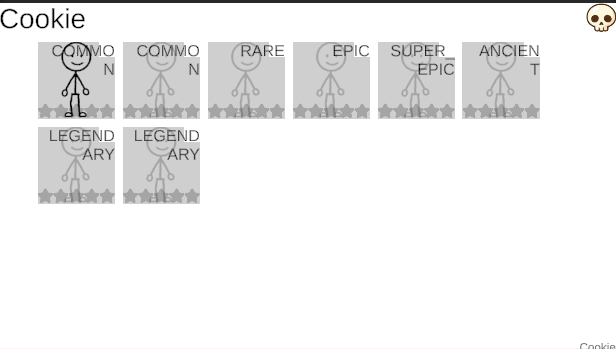
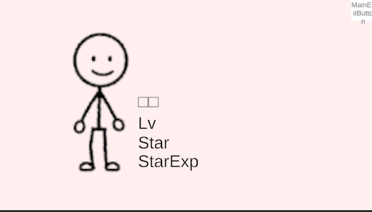

# 2025-11-01 개발 노트

쿠키 목록 화면과 쿠키 상세 팝업의 기초 UI를 구현했다.

## 1. 쿠키 리스트 — 보유 여부 구분 표시

서버에서 보유한 쿠키만 선명하게 표시하고, 미보유 쿠키는 흐리게 처리해 구분했다.

## 2. 쿠키 슬롯 클릭 시 상세 정보 팝업

쿠키 슬롯을 클릭하면 해당 쿠키의 상세 정보를 팝업으로 표시한다.

> **TODO**: 서버 연동 필요

