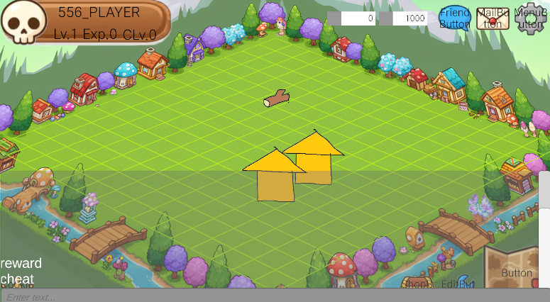

# 2025-11-11 개발 노트

인게임 치트 콘솔 팝업을 추가하고 키보드 단축키로 제어할 수 있도록 구현했다.

## 1. 치트 콘솔 팝업 적용

디버그/개발 목적의 치트 콘솔 팝업을 생성하고 기본 레이아웃을 구성했다.

## 2. 키보드 단축키 제어

- **ESC** 키 입력 시 현재 팝업을 닫는다.
- **\`(백틱)** 키 입력 시 치트 팝업을 열고 닫는다.
