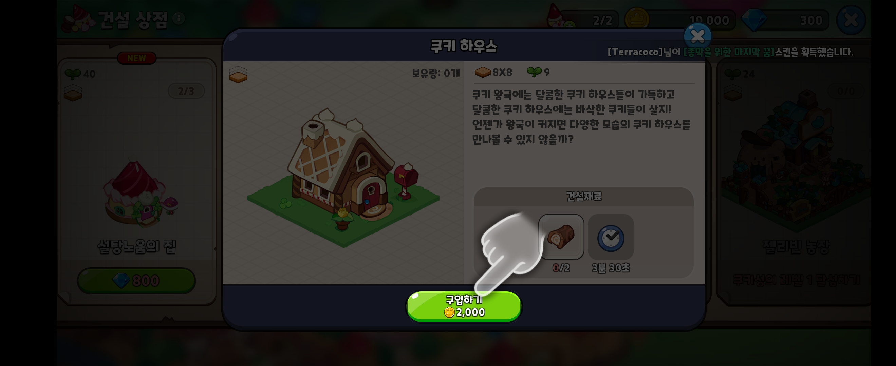
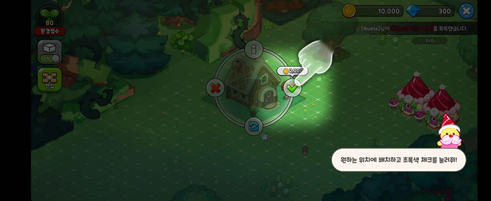
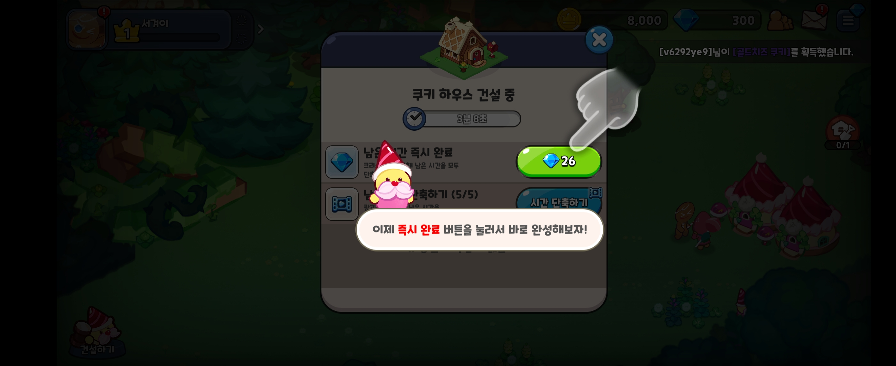
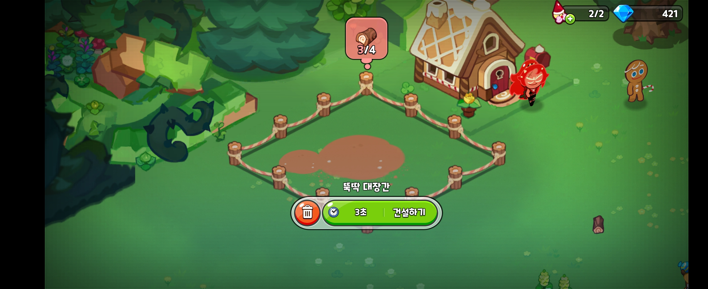
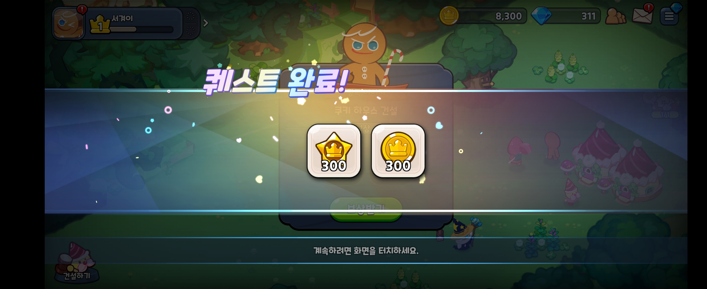
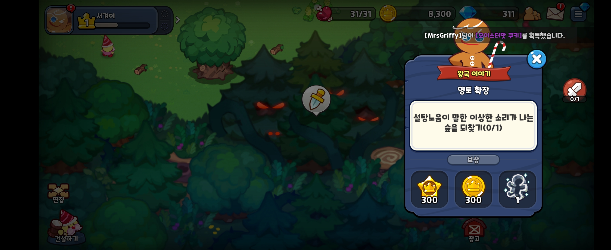

# 킹덤

1. 오브젝트 구매 

2. 오브젝트 설치

(재료 준비될때까지 대기)

3. 건설 시작 

4. 오브젝트 건설/생산 시간 단축

5. 건설 완료 보상

6. 편집

7. 퀘스트 완료

8. 새 퀘스트 시작

TODO: 문제 상황 
- DECO -> 일회성 생산품으로 이름 바꾸고 진짜 DECO만들기
- 일회성 오브젝트가 불필요하게 Id여러개 생성될거같음. 구조 변경필요. 
- 건설, 데코, 일회성 오브젝트 저장공간 분리하는게 좋을듯. 
- 별사탕은 ITEM임
- 인벤 

정리 (DB)
- 건물 : KingdomStructureItem
    - Id
    - Num
    - Type
    - State 
    - EndTime

- 꾸미기 : KingdomDecoItem
    - Num
    - TotalCnt
    - UnplacedCnt
    - State

- 위치 정보 : PlacedKingdomItem (Trash는 별도 저장없이 위치정보에 바로저장, Num, BuildingId가 비는경우 State변경)
    - Id
    - BuildingId
    - Num
    - Type (Construction, Deco)
    - BaseTileX: 기준 타일의 X 좌표
    - BaseTileY: 기준 타일의 Y 좌표
    - SizeX: 건물의 가로 크기
    - SizeY: 건물의 세로 크기
    - Rotation: 회전 상태 (0, 90, 180, 270)
    - State

정리 (PROTO)
KingdomItemProto
- Type: STRUCTURE, DECO, TRASH

기타
- 별사탕 필드 제거, Item 테이블 추가

---

# 뚝딱 대장간 (슬롯이 있는 건물)
# 나무꾼의 집
- 재료 -> 도구
- 제작 슬롯 존재
    - 슬롯 확장
- 쿠키 선택

제작 완료